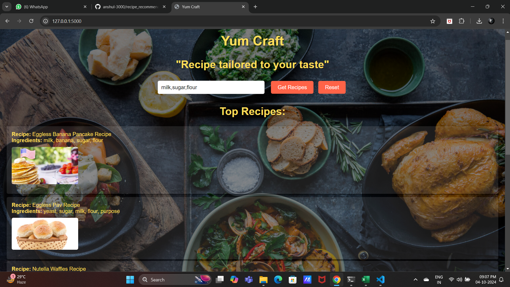

# Yum Craft
## 🍽️ Recipe Recommendation System

This repository contains the code and resources for a *Recipe Recommendation System*. The system uses a trained machine learning model to suggest recipes based on user input. The project includes data scraping, preprocessing, model training, and a Flask API to serve recipe recommendations.

## 🌐 Website Preview

## 📁 Project Structure

- *recipe-recommendation-api/*
  - *api/*
    - app.py                   # 🖥️ Main Flask application for API
    - main.py                  # Flask application for Website
    - route.py                 # 🔄 API route definitions
    - requirements.txt         # 📦 Python dependencies
    - testapi.py               # Testing API
  - *data/*
    - *raw/*
      - recipes_raw.csv       # 📊 Raw recipe data
      - recipes_raw(without hindi).csv  # 📊 Raw data (excluding Hindi text)
    - *processed/*
      - recipes_processed.csv  # 🧹 Preprocessed recipe data
  - *models/*
    - train_model.ipynb       # 📓 Model training notebook
    - recipe_recommendation_model.pkl  # 🤖 Trained recommendation model
  - *scraping/*
    - scrape_recipes.ipynb    # 🍴 Web scraping notebook for collecting recipes
  - *static/*
    - *images/*
      - [background image]     # 🖼️ Background image for the website
  - *templates/*
    - index.html               # 🌐 Main HTML file for the web interface
  - README.md                  # 📖 Project overview and instructions

## 🌟 Project Overview

The *Recipe Recommendation System* allows users to get recipe recommendations based on the ingredients they provide. The project is structured as follows:

- *📊 Data Collection*: Recipes are scraped from the web using the script in the scraping/ folder. This script collects recipe data, including ingredients, preparation methods, and images from multiple sources, saving them in CSV format for further processing.
  
- *🧹 Data Preprocessing*: Raw recipe data is cleaned and processed to generate the recipes_processed.csv file. This involves cleaning ingredient lists, removing duplicates, and converting the data into a format suitable for machine learning, with ingredient vectors created for each recipe.

- *🤖 Model Training*: A machine learning model is trained using the preprocessed data and saved as recipe_recommendation_model.pkl. The model uses cosine similarity to recommend recipes based on ingredient vectors, ensuring relevant and personalized recommendations for the user.

- *🖥️ API*: A Flask-based API serves the recommendations, with routes defined in route.py and served via app.py. The API accepts user input (a list of ingredients) and returns a list of recommended recipes. It processes the input to generate a vector representation and calculates similarity scores to find matching recipes.

- *🌐 Web Interface*: The API is connected to a simple web interface (index.html), where users can input ingredients and get recipe recommendations. The web interface allows for easy interaction with the recommendation system, displaying recipe suggestions.

## 🚀 Getting Started

### 🛠️ Prerequisites

Ensure you have Python 3.x installed on your system. You will also need to install the required Python libraries listed in requirements.txt.

### ⚙️ Installation

1. Clone the repository:
    bash
    git clone https://github.com/anshul-3000/recipe_recommendation
    

2. Navigate to the project directory:
    bash
    cd recipe-recommendation-api
    

3. Install dependencies:
    bash
    pip install -r api/requirements.txt
    

### ▶️ Running the Project

1. *Start the Flask API*:
    bash
    cd api
    python main.py
    

2. *Access the Web Interface*: Open a browser and go to http://127.0.0.1:5000/. You can input your ingredients, and the system will return recipe recommendations.

## 🧪 Testing the API

You can use the testapi.py file to test the Flask API endpoints by running the script. The script sends a POST request with user-provided ingredients to the /api/recommend route and displays the returned recipe recommendations.

### Example usage:

bash
python testapi.py

## 📡 API Example

### Request
Send a POST request to the /api/recommend endpoint with a JSON body containing the list of ingredients:

json
{
  "ingredients": "tomato, cheese, basil"
}

### 🧠 Model Training

To train or retrain the recommendation model:

1. Open models/train_model.ipynb and run all cells to train the model using the preprocessed data (recipes_processed.csv).
2. The trained model will be saved as recipe_recommendation_model.pkl in the models directory.

### 🍴 Scraping Recipes

To scrape new recipes, run the notebook scraping/scrape_recipes.ipynb. This will gather recipe data from the specified sources and save it to the data/raw folder.

## 🤝 Contributing

Feel free to submit issues or pull requests if you have suggestions for improving the system or adding new features.

## 📜 License

This project is licensed under the [MIT License](LICENSE).
